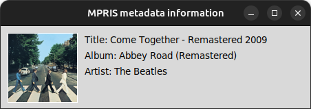

# MRPIS2 example programs

These are a collection of linux programs that interact or use the D-bus MPRIS (Meia Player Remote Interfacing
Specification).

## Create a virtual environment and install python packages

First, we have to create a virtual environment and installed the packages from the requirements.txt:
```bash
python3 -m venv ./mpris-venv
source ./mpris-venv/bin/activate
pip3 install -r requirements.txt
```
Here is the list of the packages installed:
- dbus-python 1.3.2
- Pillow      9.5.0
- tk          0.1.0

## Install MPRIS2 library

For mpris2 download the source code from [mpris2 repo](https://github.com/hugosenari/mpris2/tree/master).
The source code comes with other files but for this project we get rid of most of them and only left the mpris2 folder
with the python scripts.

## Programs

The programs request the info from Spotify desktop application so you have to launch that app before running any of the
programs. If the app is not running an error is thrown when executing the programs.

### Show track information

The ***mpris-track-info.py*** programs shows the current track information playing on Spotify.

```bash
python3 mpris-track-info.py
```

### GUI to show track information

This program is similar to the above but also displays the album cover fo the current track playing on Spotify.

```bash
python3 gui-track-info.py
```



## Useful links

The following links are repositories that were used as inspiration for these projects:
- https://github.com/marcinn/letsplay
- https://github.com/hugosenari/mpris2
- https://github.com/dylanlobo/mpris-dbus-apps
- https://github.com/inopia/gnome-media-mpris
- https://github.com/RangHo/mprisctl
- https://github.com/patrickziegler/spotify-recorder
- https://github.com/Bleuzen/SpotRec
- https://github.com/alexdelorenzo/cast_control
- https://github.com/icasdri/mpris2controller
- https://specifications.freedesktop.org/mpris-spec/latest/
- https://dbus.freedesktop.org/doc/dbus-python/dbus.html
- https://stackoverflow.com/questions/70737550/how-to-connect-to-mediaplayer2-player-playbackstatus-signal-using-pygtk